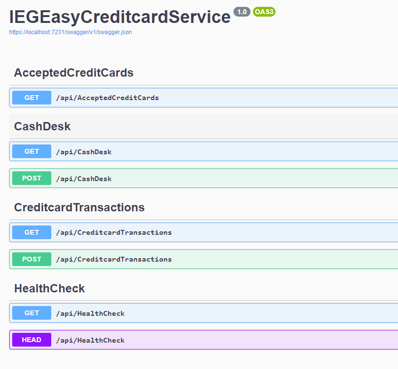
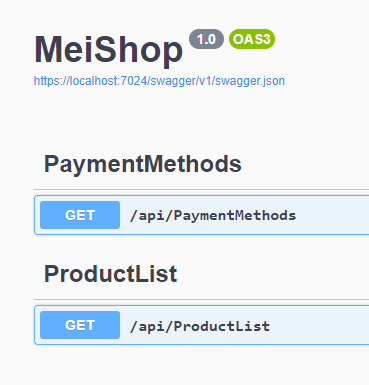

# Analyse & DDD

Aufgabe 1:
a)
Analyse: Machen Sie sich mit dem Ausgangs-Source-Code „SolTradingPlatform (ohne Polly)“ vertraut. Publizieren Sie die beiden Services „MeiShop“ und „IEGEasyCreditCardService“ in die Microsoft Azure Cloud und testen Sie die Funktionalität. Alternativ können Sie die Projekte natürlich auch onpremise hosten (0 Punkte)

Hosting -> On-premise

b)
Beschreiben Sie zuerst den Ansatz „Domain-Driven Design (DDD) im Zusammenhang mit Microservices. Überlegen Sie welche weiteren Microservices in Zusammenhang mit der Trading Platform sinnvoll wären. Beschreiben Sie danach die Funktionalitäten / Verantwortlichkeiten der einzelnen Microservices – Stichwort: Business Capabilities

Domain-Driven Design (DDD) fokussiert darauf, Softwaremodelle zu erstellen, die die Komplexität des Geschäftsfeldes abbilden. Wichtige Konzepte sind Domänen, Entitäten, Wertobjekte, Aggregate, Repositories, Services und Bounded Contexts.

Microservices passen gut zu DDD, da jeder Microservice um einen Bounded Context gebaut wird, was eine klare Abgrenzung und Fokussierung auf einzelne Geschäftsbereiche ermöglicht. Dies fördert Skalierbarkeit, Flexibilität und Wartbarkeit.

**Weitere Microservices**:
* Usermanagement: Registrierung, Authentifizierung, Profilverwaltung
* Auftragsmanagement: Erstellung, Aktualisierung, Stornierung und Abfrage von Aufträgen
* Marktdatenmanagement: Bereitstellung von Echtzeit- und historischen Marktdaten
* Benachrichtigungen: Verwaltung und Versand von Benachrichtigungen (E-Mail, SMS, Push)

**Detailbeschreibung der angebotenen Schnittstellen inkl. Datenaustauschformate**
* IEGEasyCreditcardService: Siehe Screenshot Aufgabe 1:
    * Get: Holen der Daten, Return Value: Json
    * Post: Anlegen von Daten, Body Value: Json, Return Value = Status Code 
* MeiShop: Siehe Screenshot Aufgabe 1:
    * Get: Holen der Daten, Return Value: Json
    * Post: Anlegen von Daten, Body Value: Json, Return Value = Status Code 

**Detailbeschreibung der Datenhaltung – Stichwort: Decentralized Data Management**
In einer Microservices-Architektur verwaltet jeder Service seine eigenen Daten. Dadurch sind die Services lose gekoppelt, was ihre Unabhängigkeit und Skalierbarkeit verbessert. Jeder Service hat seine eigene Datenbank, die speziell auf seine Bedürfnisse abgestimmt ist.

Datenkonsistenz wird durch Eventual Consistency und ereignisgesteuerte Kommunikation erreicht. Services tauschen Daten nur über APIs aus, was direkte Datenbankzugriffe vermeidet und die Service-Autonomie stärkt.

