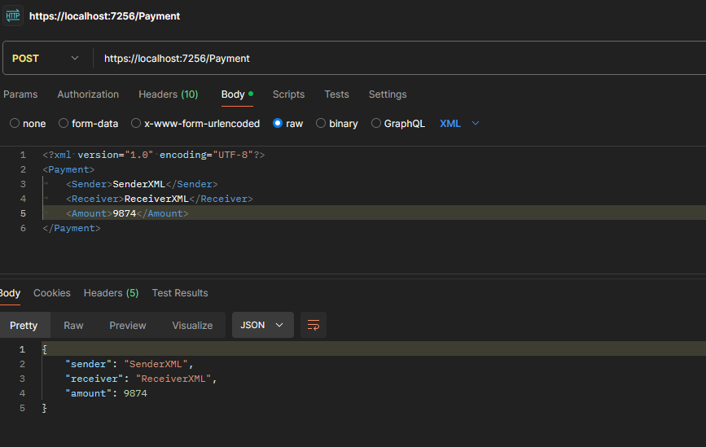

## GET DIFFERENT CONTENT TYPES
### GET JSON

### GET XML

### GET CSV

## POST DIFFERENT CONTENT TYPES
Während aller POST-Tests wurde der 'Accept'-Header auf 'application/json' gesetzt und nicht auf 'application/xml' oder 'text/csv'. Bei 'text/csv' wird lediglich der Statuscode 201 (Created) zurückgegeben, jedoch nicht die erstellten Werte.

### POST JSON

### POST XML

### POST CSV

